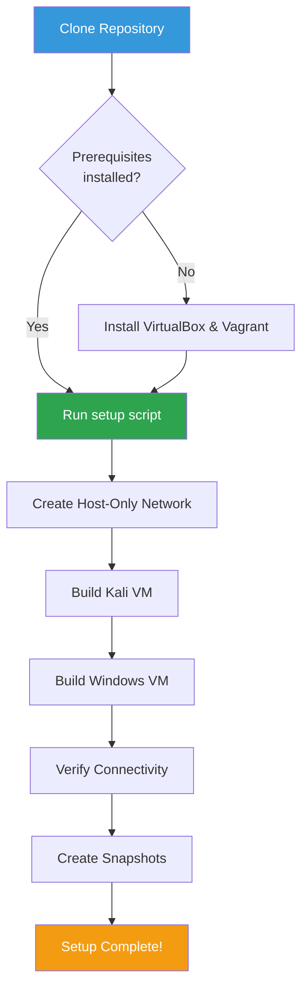
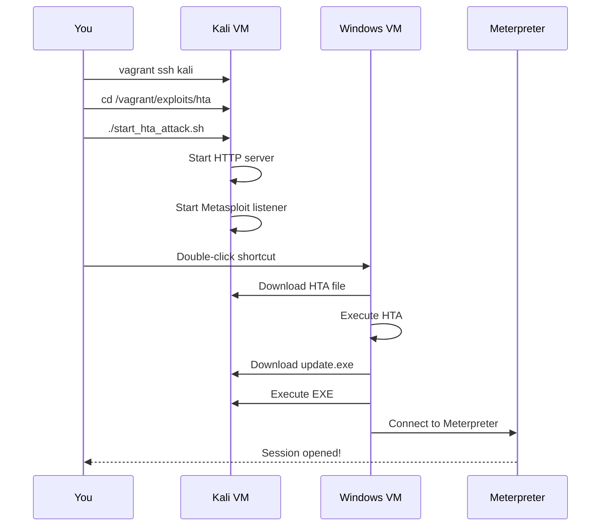

# Installation Guide - HTA Exploit Lab

Step-by-step setup instructions for the ethical hacking lab environment.

---

## Table of Contents

1. [System Requirements](#system-requirements)
2. [Pre-Installation](#pre-installation)
3. [Installing Prerequisites](#installing-prerequisites)
4. [Automated Installation](#automated-installation)
5. [Verification](#verification)
6. [Next Steps](#next-steps)

---

## System Requirements

### Minimum Requirements

| Component | Requirement |
|-----------|-------------|
| **OS** | Windows 10/11, macOS 10.15+, Ubuntu 20.04+ |
| **CPU** | Intel VT-x or AMD-V capable processor |
| **RAM** | 8 GB |
| **Disk** | 40 GB free space |
| **Network** | Internet connection for initial setup |

### Recommended Requirements

| Component | Recommendation |
|-----------|----------------|
| **RAM** | 16 GB or more |
| **CPU** | 4+ cores |
| **Disk** | SSD with 60+ GB free |
| **Network** | Wired connection (faster downloads) |

---

## Pre-Installation

### 1. Enable Virtualization

Virtualization must be enabled in your system BIOS/UEFI.

**Check if enabled:**

**Linux:**
```bash
egrep -c '(vmx|svm)' /proc/cpuinfo
# Output > 0 = enabled
```

**macOS:**
```bash
sysctl -a | grep machdep.cpu.features | grep VMX
# Output with VMX = enabled
```

**Windows:**
```powershell
systeminfo | findstr /i "Virtualization"
# Should show: "Enabled"
```

**If disabled:**
1. Reboot computer
2. Enter BIOS/UEFI (F2, F10, DEL, or ESC during boot)
3. Find "Virtualization Technology" or "VT-x" or "AMD-V"
4. Enable it
5. Save and reboot

---

### 2. Check Disk Space

**All platforms:**
```bash
df -h .           # Linux/macOS
```

```powershell
Get-PSDrive C     # Windows
```

Ensure you have **40+ GB free** on the installation drive.

---

## Installing Prerequisites

### VirtualBox Installation

**Download:** https://www.virtualbox.org/wiki/Downloads

| Platform | Installation |
|----------|--------------|
| **Windows** | Run `.exe` installer, follow prompts |
| **macOS** | Open `.dmg`, drag to Applications, approve in Security & Privacy |
| **Ubuntu/Debian** | `sudo apt install virtualbox` |
| **Fedora/RHEL** | `sudo dnf install VirtualBox` |

**Verify:**
```bash
VBoxManage --version
# Expected: 7.0.x or higher
```

---

### Vagrant Installation

**Download:** https://www.vagrantup.com/downloads

| Platform | Installation |
|----------|--------------|
| **Windows** | Run `.msi` installer |
| **macOS** | `brew install vagrant` or use `.dmg` |
| **Ubuntu/Debian** | Download `.deb` from website |
| **Fedora/RHEL** | Download `.rpm` from website |

**Verify:**
```bash
vagrant --version
# Expected: 2.3.x or higher
```

---

## Automated Installation

### Installation Workflow



---

### Step 1: Clone Repository

```bash
git clone https://github.com/gcheliz/ethical-hacking-student-lab.git
cd ethical-hacking-student-lab
```

---

### Step 2: Run Setup Script

**macOS/Linux:**
```bash
./setup.sh
```

**Windows (PowerShell as Administrator):**
```powershell
.\setup.ps1
```

---

### Setup Process Timeline

```mermaid
gantt
    title Lab Setup Timeline
    dateFormat  mm
    section Network
    Create Host-Only Network      :done, 00, 1m
    section Kali VM
    Download Kali box (~3GB)       :active, 01, 5m
    Create VM (3GB RAM, 2 CPU)     :02, 2m
    Configure network              :03, 1m
    Install Metasploit             :04, 2m
    Generate exploits              :05, 1m
    section Windows VM
    Download Windows box (~5GB)    :06, 10m
    Create VM (4GB RAM, 2 CPU)     :07, 3m
    Disable security               :08, 3m
    Install Adobe Reader           :09, 2m
    Configure network              :10, 1m
    section Finalize
    Test connectivity              :11, 1m
    Create snapshots               :12, 1m
```



**Total Time:** 15-30 minutes (depending on download speed)

---

### What Happens During Setup

#### Phase 1: Network Configuration (1 minute)
- Creates Host-Only network (192.168.56.0/24)
- Configures network adapter
- Disables DHCP

#### Phase 2: Kali Linux VM (5-10 minutes)
- Downloads Kali Linux box (~3 GB)
- Creates VM with 3GB RAM, 2 CPUs
- Configures network (192.168.56.101)
- Installs Metasploit and tools
- Generates Meterpreter EXE payload
- Generates malicious HTA file
- Sets up HTTP server (auto-starts on boot)

#### Phase 3: Windows Server 2008 R2 VM (20-30 minutes)
- Downloads Windows box (~5 GB)
- Creates VM with 4GB RAM, 2 CPUs
- Configures network (192.168.56.102)
- Disables Windows Firewall
- Disables Windows Defender
- Disables UAC
- Disables AppLocker
- Installs Adobe Reader (for PDF icon)
- Creates desktop shortcuts for attack delivery

#### Phase 4: Verification & Snapshots (2 minutes)
- Tests Kali → Windows connectivity
- Tests Windows → Kali connectivity
- Creates "Clean_State" snapshots for easy reset

---

## Verification

### Check VM Status

```bash
cd vagrant
vagrant status
```

**Expected output:**
```
kali      running (virtualbox)
win2k8    running (virtualbox)
```

---

### Verify Network Connectivity

**Test from Kali:**
```bash
vagrant ssh kali
ping -c 2 192.168.56.102
# Expected: 2 packets transmitted, 2 received, 0% packet loss
```

**Test from Windows:**
```powershell
vagrant winrm win2k8 -c "Test-Connection 192.168.56.101 -Count 2"
# Expected: 2 packets sent, 2 received
```

---

### Verify Exploit Files

```bash
vagrant ssh kali
ls -la /home/vagrant/hta_payloads/
```

**Expected files:**
```
update.exe                      # Meterpreter EXE payload (~73KB)
Joan_Espinach_hta_social_engineering.pdf.hta # Malicious HTA file
Test_EXE_Download.hta           # Testing HTA file
```

---

### Verify HTTP Server

```bash
vagrant ssh kali
sudo systemctl status hta-http-server
# Expected: Active: active (running)
```

**Test from Windows:**
```powershell
vagrant winrm win2k8 -c "Invoke-WebRequest http://192.168.56.101:8080/"
# Expected: StatusCode: 200
```

---

## Post-Installation

### First Attack Test



**Commands:**
```bash
# 1. SSH into Kali
cd vagrant
vagrant ssh kali

# 2. Navigate to HTA exploits
cd /vagrant/exploits/hta

# 3. Start the attack
./start_hta_attack.sh

# 4. On Windows VM: Double-click "Download_Exploit_from_Kali"
# 5. Double-click the downloaded file
# 6. Meterpreter session should open!
```

---

### Create Clean Snapshot (if needed)

The setup script automatically creates snapshots. If you need to create manual snapshots:

```bash
# Get VM names
VBoxManage list vms

# Create snapshot
VBoxManage snapshot "kali_vm_name" take "My_Snapshot" --description "Description"
VBoxManage snapshot "windows_vm_name" take "My_Snapshot" --description "Description"
```

---

## Platform-Specific Notes

### macOS

**Security & Privacy:**
- First run may require approval in System Preferences > Security & Privacy
- Allow VirtualBox kernel extensions
- May need to reboot after VirtualBox installation

**VirtualBox 7.0+ on Apple Silicon (M1/M2):**
- VirtualBox 7.0+ supports Apple Silicon
- Performance may vary compared to Intel Macs
- Ensure latest VirtualBox version

---

### Windows

**Administrator Rights:**
- Run PowerShell as Administrator for setup
- Required for VirtualBox network adapter creation

**Windows Defender:**
- May flag exploit files as malicious (expected behavior)
- Add repository folder to exclusions if needed

**Hyper-V Conflict:**
- Disable Hyper-V if installed (conflicts with VirtualBox)
- Run: `bcdedit /set hypervisorlaunchtype off` (requires reboot)

---

### Linux

**Package Conflicts:**
- Remove conflicting virtualbox packages: `sudo apt purge virtualbox-dkms`
- Install from official VirtualBox repository

**Kernel Modules:**
- VirtualBox requires kernel modules
- Run `sudo /sbin/vboxconfig` if modules fail to load

---

## Quick Troubleshooting

**If setup fails, check:**

| Issue | Quick Fix |
|-------|-----------|
| VT-x not enabled | Enable in BIOS/UEFI |
| Insufficient disk space | Free up 40+ GB |
| Network adapter fails | Run `vagrant reload` |
| Download timeout | Check internet connection |
| VM won't start | Ensure VT-x enabled, reboot |

**For detailed troubleshooting:** See [TROUBLESHOOTING.md](TROUBLESHOOTING.md)

---

## Next Steps

Once installation is complete:

1. ✅ Read [User Guide](docs/USER_GUIDE.md) for attack scenarios
2. ✅ Run your first attack
3. ✅ Explore [Meterpreter Commands](docs/METERPRETER_USAGE_GUIDE.md)
4. ✅ Review [Learning Objectives](docs/LEARNING_OBJECTIVES.md)
5. ✅ Study [Technical Details](exploits/hta/README.md)

---

## Uninstallation

To completely remove the lab:

```bash
# Destroy VMs and free disk space
./cleanup.sh

# Remove Vagrant boxes
vagrant box remove kalilinux/rolling
vagrant box remove rapid7/metasploitable3-win2k8

# Remove repository
cd ..
rm -rf ethical-hacking-student-lab
```

---

**Installation complete? Start attacking!** See [docs/USER_GUIDE.md](docs/USER_GUIDE.md)

---

**Version:** 2.0 - HTA Exploit Lab
**Last Updated:** 2026-01-10
