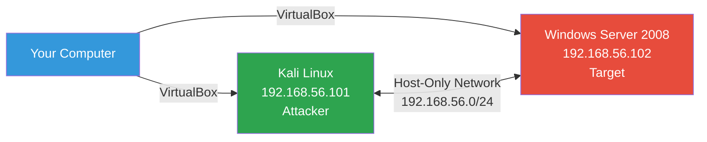
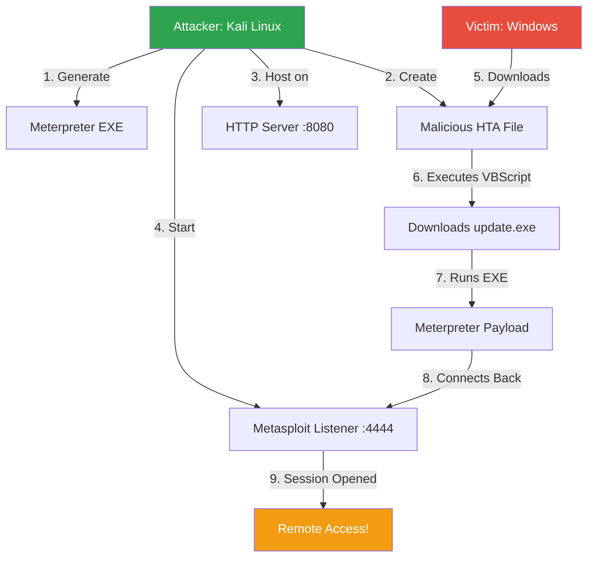
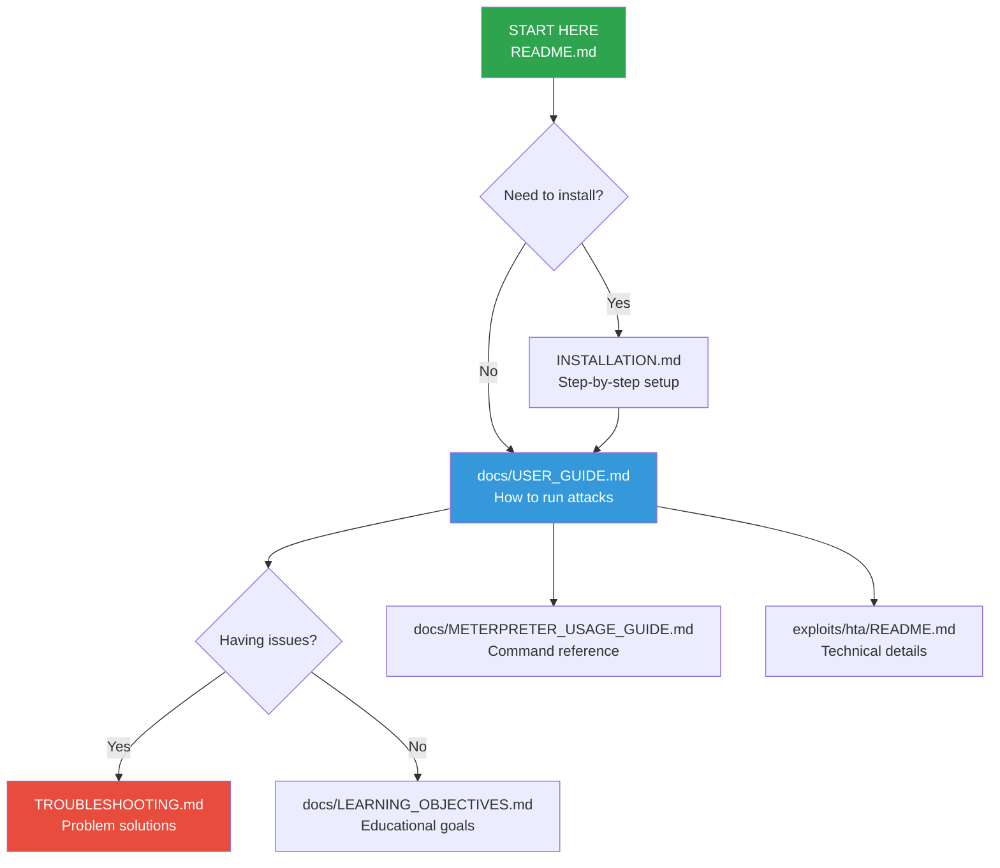
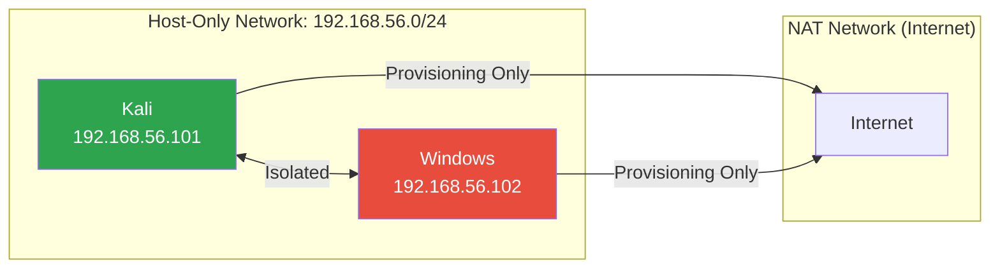
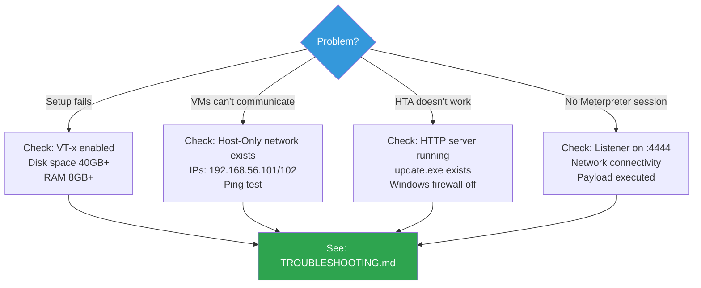

# Ethical Hacking Lab - HTA Exploit

**Automated penetration testing environment for students**
Set up a complete lab in under 30 minutes with one command.

[](LICENSE)
[](https://www.virtualbox.org/)
[](https://www.vagrantup.com/)

---

## Overview

This lab demonstrates **social engineering attacks** using malicious HTA files disguised as PDFs. Learn offensive and defensive security in a safe, isolated environment.

### Lab Architecture



### Attack Workflow



---

## Quick Start

### Prerequisites

| Component | Minimum |
|-----------|---------|
| **OS** | Windows 10, macOS 10.15, Ubuntu 20.04 |
| **CPU** | VT-x/AMD-V enabled, 2+ cores |
| **RAM** | 8 GB |
| **Disk** | 40 GB free |
| **Software** | VirtualBox 7.0+, Vagrant 2.3+ |

### Installation

**macOS/Linux:**
```bash
git clone https://github.com/gcheliz/ethical-hacking-student-lab.git
cd ethical-hacking-student-lab
./setup.sh
```

**Windows (PowerShell as Administrator):**
```powershell
git clone https://github.com/gcheliz/ethical-hacking-student-lab.git
cd ethical-hacking-student-lab
.\setup.ps1
```

Setup takes 15-30 minutes and is fully automated.

### First Attack

```bash
# 1. Access Kali
cd vagrant && vagrant ssh kali

# 2. Start attack
cd /vagrant/exploits/hta
./start_hta_attack.sh

# 3. On Windows VM: Double-click "Download_Exploit_from_Kali"
# 4. Double-click downloaded file → Get Meterpreter session!
```

### Basic Meterpreter Commands

```bash
meterpreter> sysinfo        # System info
meterpreter> getuid         # Current user
meterpreter> screenshot     # Capture screen
meterpreter> shell          # Windows command prompt
meterpreter> help           # All commands
```

### Reset Lab

```bash
./reset.sh    # Restore VMs to clean state (30 seconds)
```

---

## Documentation Map



**Quick Links:**
- **[Installation Guide](INSTALLATION.md)** - System setup
- **[User Guide](docs/USER_GUIDE.md)** - Attack scenarios and usage
- **[Troubleshooting](TROUBLESHOOTING.md)** - Common issues
- **[Meterpreter Commands](docs/METERPRETER_USAGE_GUIDE.md)** - Post-exploitation reference
- **[Learning Objectives](docs/LEARNING_OBJECTIVES.md)** - Educational outcomes
- **[Technical Details](exploits/hta/README.md)** - HTA exploit deep-dive

---

## What You'll Learn

| Category | Skills |
|----------|--------|
| **Offensive** | Social engineering, HTA exploitation, Meterpreter usage, payload generation |
| **Defensive** | Security controls, attack detection, incident response, user awareness |
| **Tools** | Metasploit Framework, VirtualBox, Vagrant, Kali Linux |
| **Concepts** | Reverse shells, network isolation, post-exploitation, MITRE ATT&CK |

---

## Lab Components

### Virtual Machines

| VM | OS | IP | Role | Security |
|----|----|----|------|----------|
| **kali** | Kali Linux 2024 | 192.168.56.101 | Attacker | Metasploit, HTTP server |
| **win2k8** | Windows Server 2008 R2 | 192.168.56.102 | Target | All defenses disabled |

### Generated Exploit Files

| File | Type | Purpose |
|------|------|---------|
| `update.exe` | EXE (73KB) | Meterpreter reverse TCP payload |
| `Joan_Espinach_hta_social_engineering.pdf.hta` | HTA | VBScript that downloads + executes EXE |

### Network Configuration



---

## Safety and Ethics

This lab is for **authorized educational purposes only**.

| Do | Don't |
|----|-------|
| Use in isolated lab environment | Attack real systems without authorization |
| Learn offensive AND defensive techniques | Share exploits for malicious purposes |
| Practice responsible disclosure | Bypass security without permission |
| Follow lab ethical guidelines | Violate computer fraud laws |

**Legal:** Unauthorized computer access is illegal (CFAA, Computer Misuse Act, etc.). Use only in controlled educational settings.

---

## MITRE ATT&CK Mapping

| Technique | ID | Lab Coverage |
|-----------|----|----|
| User Execution: Malicious File | T1204.002 | HTA file execution |
| Mshta | T1218.005 | HTA application abuse |
| Command and Scripting Interpreter: PowerShell | T1059.001 | Download + execute |
| Ingress Tool Transfer | T1105 | EXE download from HTTP |
| Application Layer Protocol | T1071 | HTTP for C2 communication |

---

## Troubleshooting

### Quick Diagnostics



**Common Fixes:**
- **VMs won't start:** Enable VT-x/AMD-V in BIOS
- **Network issues:** Run `vagrant reload` to reset network
- **HTTP server down:** `sudo systemctl start hta-http-server` on Kali
- **Listener fails:** Check if port 4444 is available

See [TROUBLESHOOTING.md](TROUBLESHOOTING.md) for comprehensive solutions.

---

## Project Structure

```
ethical-hacking-student-lab/
├── setup.sh / setup.ps1           # Automated installation
├── reset.sh / reset.ps1           # Reset VMs to clean state
├── vagrant/                       # VM configurations
│   ├── Vagrantfile               # VM definitions
│   └── provisioning/             # Automated setup scripts
├── exploits/hta/                 # HTA exploit scripts
│   ├── create_exe_payload.sh    # Generate Meterpreter EXE
│   ├── start_hta_attack.sh      # Launch attack automation
│   └── README.md                # Technical documentation
├── docs/                         # Additional documentation
│   ├── USER_GUIDE.md            # Comprehensive usage guide
│   ├── METERPRETER_USAGE_GUIDE.md  # Command reference
│   └── LEARNING_OBJECTIVES.md   # Educational outcomes
└── resources/                    # Adobe Reader installer
```

---

## Credits

Built with:
- [Kali Linux](https://www.kali.org/) - Penetration testing distribution
- [Metasploit Framework](https://www.metasploit.com/) - Exploitation framework
- [VirtualBox](https://www.virtualbox.org/) - Virtualization platform
- [Vagrant](https://www.vagrantup.com/) - VM automation

---

## License

**Educational Use Only** - See [LICENSE](LICENSE) for details.

This project is intended for authorized security training and education. The authors are not responsible for misuse or illegal activities.

---

## Support

- **Issues:** [GitHub Issues](https://github.com/gcheliz/ethical-hacking-student-lab/issues)
- **Documentation:** See [docs/](docs/) folder
- **Troubleshooting:** See [TROUBLESHOOTING.md](TROUBLESHOOTING.md)

---

**Version:** 2.0 - HTA Exploit Lab
**Last Updated:** 2026-01-10

**Ready to start? Run `./setup.sh` and begin learning!**
